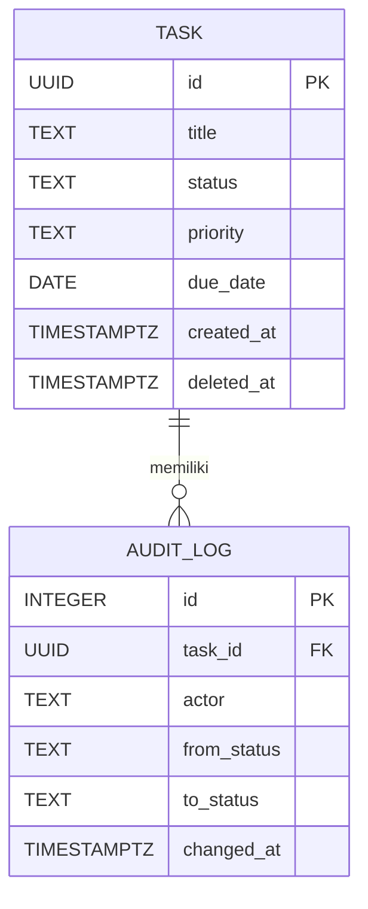

# ERD — Mini Task Manager

Model data ini mengikuti [PRD.md](PRD.md) dan ketentuan audit log pada [TASK_SPEC.md](TASK_SPEC.md). Hanya ada dua entitas. Actor disimpan sebagai teks dari daftar tetap, sehingga tidak memerlukan tabel pengguna.

## Field dan aturan

| Entitas | Field | Aturan |
| --- | --- | --- |
| `TASK` | `id` | UUID dari server, primary key. |
| `TASK` | `title` | Wajib, teks yang tidak kosong setelah di-trim. |
| `TASK` | `status` | Wajib; salah satu `to_do`, `pending`, `in_progress`, `done`; nilai awal `to_do`. |
| `TASK` | `priority` | Wajib; `low`, `medium`, atau `high`; nilai awal `medium`. |
| `TASK` | `due_date` | Nullable; tanggal tenggat tanpa jam. |
| `TASK` | `created_at` | Wajib; waktu pembuatan dalam ISO 8601 UTC. |
| `TASK` | `deleted_at` | Nullable; terisi saat task dihapus dari daftar aktif. |
| `AUDIT_LOG` | `id` | Bilangan naik otomatis, primary key dan pemutus urutan jika waktu sama. |
| `AUDIT_LOG` | `task_id` | Wajib; foreign key ke `TASK.id`. |
| `AUDIT_LOG` | `actor` | Wajib; nama dari dropdown actor tetap. |
| `AUDIT_LOG` | `from_status` | Wajib; status task sebelum perubahan. |
| `AUDIT_LOG` | `to_status` | Wajib; status task setelah perubahan. |
| `AUDIT_LOG` | `changed_at` | Wajib; waktu perubahan dalam ISO 8601 UTC. |

Satu task dapat memiliki nol atau banyak audit log; setiap log milik tepat satu task. Task baru belum mempunyai log karena belum ada perubahan status.

## Invarian penyimpanan

- `AUDIT_LOG.task_id` merujuk ke task yang tetap disimpan saat *soft delete*; tidak ada cascade delete untuk log.
- Perubahan `TASK.status` dan penambahan satu `AUDIT_LOG` dilakukan oleh fungsi PostgreSQL dalam transaksi yang sama. Permintaan ke status yang sama tidak menjalankan keduanya.
- Backend memvalidasi nilai status dan actor; fungsi database memvalidasi bahwa `to_status` adalah langkah langsung berikutnya setelah `from_status`. Nilai `from_status` dibaca dari task yang tersimpan.
- `AUDIT_LOG` hanya menerima `INSERT`; trigger database menolak `UPDATE` dan `DELETE`. Aplikasi tidak menyediakan API untuk kedua operasi itu.
- Row Level Security di Supabase mencegah akses tabel langsung dari browser. Express menggunakan kunci server yang tidak dikirim ke frontend.
- Riwayat dibaca dengan urutan `changed_at ASC, id ASC`.
